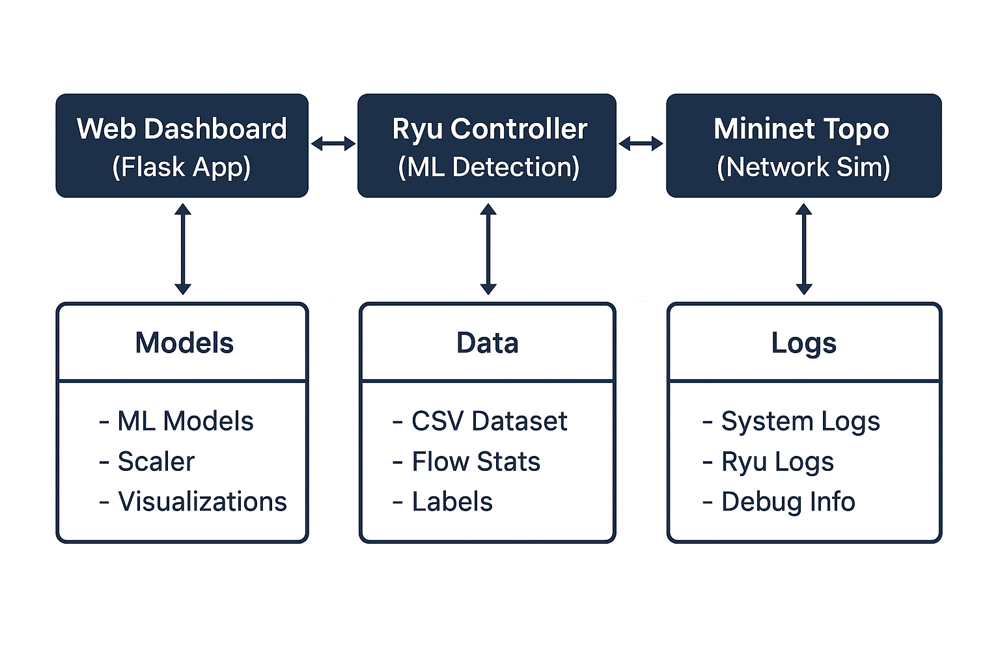

# GuarDDoS - A Prototypical Experiment in the Sphere of Network Security

## Description

**GuarDDoS** is an prototypical experiment over network security system that practices SDN technology as a collaborator with machine learning algorithms to detect and analyze Distributed Denial of Service (DDoS) attacks in real-time.  
It uses **Ryu SDN Controller**, **Mininet network emulation**, and multiple ML models to provide intelligent network traffic analysis and threat detection.

---
## Project Schema(s)

---
## Tech Stack

| Component         | Technology Used |
|-------------------|-----------------|
| **Controller**    | Ryu SDN Controller (OpenFlow 1.3) |
| **Network Emulation** | Mininet |
| **Machine Learning**  | Scikit-learn, TensorFlow/Keras |
| **Web Dashboard**     | Flask, Chart.js |
| **Containerization**  | Docker & Docker Compose |
| **Attack Simulation** | Hping3, custom traffic scripts |

---
## Key Features

-   **Real-time DDoS Detection**: Uses machine learning models trained on network flow statistics.
-   **SDN Integration**: Leverages OpenFlow protocol with the Ryu controller for dynamic network monitoring.
-   **Multiple Attack Simulation**: Supports SYN flood, UDP flood, and ICMP flood attacks.
-   **Interactive Dashboard**: A web-based interface for real-time monitoring and visual analytics.
-   **Comprehensive ML Pipeline**: Includes training and evaluation of 6 different ML algorithms.
-   **Automated Data Collection**: Generates labeled datasets directly from network simulations.

---
## 🎯 Objectives

-   **Network Traffic Analysis**: Monitor and analyze network flow statistics in real-time.
-   **Attack Detection**: Identify various DDoS attack patterns using machine learning.
-   **Performance Evaluation**: Compare multiple ML algorithms for optimal detection accuracy.
-   **Automated Response**: Provide real-time alerts and visualization of network threats.
-   **Educational Platform**: Demonstrate SDN and ML integration for cybersecurity.

---
